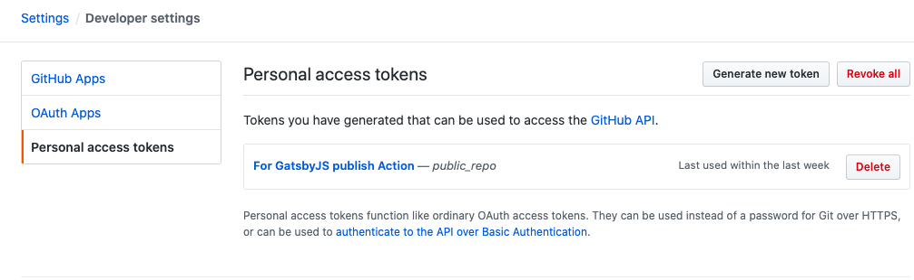
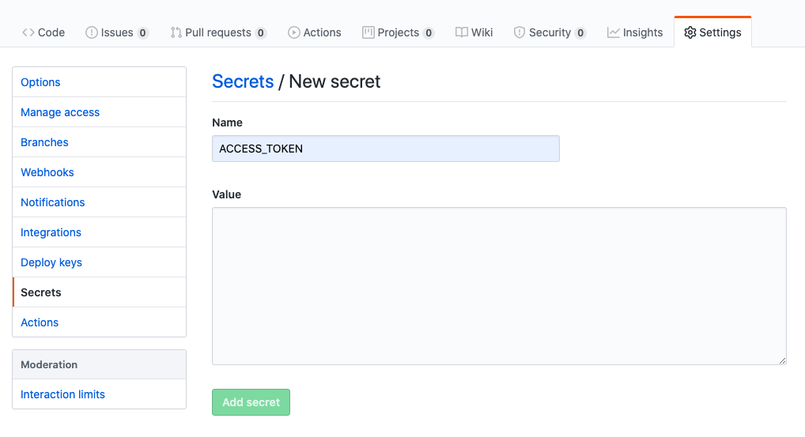

GatsbyJSでブログ記事を書いてgh-pages（参考:[GatsbyJSのサイトをGithub Pagesで公開する](../GatsbyJSのサイトをGithub_Pagesで公開する/)）でGithub Pagesにデプロイしていましたが、ソースファイルのPushとデプロイを別でやらなきゃいけないのは大変だったので、Pushしたら自動でデプロイできるように設定しました。  
Github Actionsという機能で実現できるようです。

## やること

- Github Actionsで使用するアクセストークンを準備
- Github Actionsを設定

## 構成

- Github Pagesのユーザーページ（アドレスが`https://username.github.io`）でサイトを公開
- ソースは`source`リポジトリで管理

## アクセストークンの準備

## トークンの作成

Github右上ののユーザーアイコンから`Settings > Developer settings > Personal access tokens`にて、Actionで使用するアクセストークンを生成します。  



`public_repo Access public repository`にチェックを入れてトークンを生成します。  
生成されたトークンをコピーしておいてください。

## トークンを環境変数に設定

リポジトリの`Settings > Secrets > New secret`から先ほどのトークンを暗号化された環境変数として登録します。  
今回は`Name`は`ACCESS_TOKEN`と設定します。`Value`に先ほどコピーしたトークンをペーストして`Add secrets`を押します。  



## Github ActionsのWorkflowを作成

Github ActionsのWorkflowはソースのブランチの`.github/workflows`に設定を記したymlファイルを置いておくだけで機能するようです。  
今回は以下の内容でymlファイルを作成しました。  

*github/workflows/atsby-publish.yml*
```yml
name: Gatsby Publish

on:
  push:
    branches:
      - source

jobs:
  build:
    runs-on: ubuntu-latest
    steps:
      - uses: actions/checkout@v1
      - uses: enriikke/gatsby-gh-pages-action@v2
        with:
          access-token: ${{ secrets.ACCESS_TOKEN }}
```

マーケットプレイスで公開されている[こちら](https://github.com/marketplace/actions/gatsby-publish)のActionを呼び出しているだけです。  
アクセストークンには先ほど設定した環境変数を書きます。  
ビルドしたファイルはデフォルトでは`master`ブランチにPushされます。変更したい場合は上記リンク参照。
  
これだけでPushしたときに勝手にビルドしてくれます。便利！