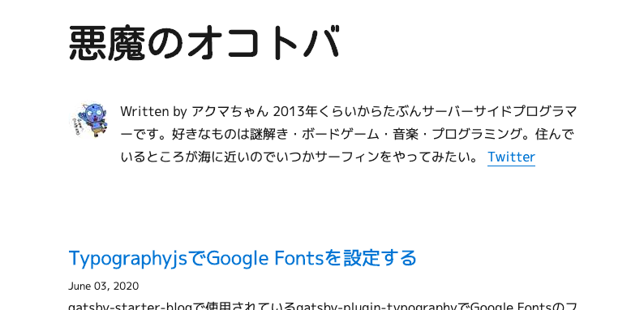

ブログのフォントを変えようと思い調べてみると、[gatsby-starter-blog](https://www.gatsbyjs.org/starters/gatsbyjs/gatsby-starter-blog/)では[gatsby-plugin-typography](https://www.gatsbyjs.org/packages/gatsby-plugin-typography/)というプラグインが使われているようです。  
  
## Typography.js

gatsby-plugin-typografyは[Typography.js](https://kyleamathews.github.io/typography.js/)のGatsbyJS用プラグインです。  
タイポグラフィとは文字のフォントや構成を整える技術のようですね。要するに文字周りを綺麗に整えてくれるライブラリです。  
  
### 設定ファイル

gatsby-starter-blogでは`/src/utils/typography.js`が設定ファイルです。

*typography.js*
```js
import Typography from "typography"
import Wordpress2016 from "typography-theme-wordpress-2016"

Wordpress2016.overrideThemeStyles = () => {
  return {
    "a.gatsby-resp-image-link": {
      boxShadow: `none`,
    },
  }
}

delete Wordpress2016.googleFonts

const typography = new Typography(Wordpress2016)

// Hot reload typography in development.
if (process.env.NODE_ENV !== `production`) {
  typography.injectStyles()
}

export default typography
export const rhythm = typography.rhythm
export const scale = typography.scale
```
あらかじめWordpress2016というテーマが設定されているようです。テーマは変えずに必要な部分だけを設定します。  

### フォントを変える

```js
import Typography from "typography"
import Wordpress2016 from "typography-theme-wordpress-2016"

Wordpress2016.headerFontFamily = ['M PLUS 1p', 'Roboto', 'serif']
Wordpress2016.bodyFontFamily = ['M PLUS 1p', 'Roboto', 'serif']
delete Wordpress2016.googleFonts
Wordpress2016.googleFonts = [
  {
    name: 'M PLUS 1p',
    styles: ['400'],
  },
  {
    name: 'Kosugi Maru',
    styles: []
  },
]
```

`.headerFontFamily`でヘッダーのフォントを設定できます。  
`.bodyFontFamily`でボディのフォントを設定できます。  
`.googleFonts`で使用する[Google Fonts](https://fonts.google.com/)のフォントとスタイルを指定します。  

### h1だけフォントが変更されない

よしこれで完成、と思いきや見出し`h1`だけフォントが変更されません。


  
ソースを見てみると、Wordpress2016テーマの中で`h1`を含む一部の要素に対しスタイルが個別で設定されており、そちらが優先されているようです。  
  
*/node_modules/typography-theme-wordpress-2016/dist/index.js*
```js
  overrideStyles: function overrideStyles(_ref, options) {
    var _ref2;

    var adjustFontSizeTo = _ref.adjustFontSizeTo,
        scale = _ref.scale,
        rhythm = _ref.rhythm;
    return _ref2 = {
      h1: {
        fontFamily: ["Montserrat", "sans-serif"].join(",")
      },
      blockquote: _extends({}, scale(1 / 5), {
        color: (0, _grayPercentage2.default)(41),
        fontStyle: "italic",
        paddingLeft: rhythm(13 / 16),
        marginLeft: rhythm(-1),
        borderLeft: rhythm(3 / 16) + " solid " + (0, _grayPercentage2.default)(10)
      }),..
      （省略）
```
  
なのでこれを設定してあげましょう。  
  
*typography.js*
```js
Wordpress2016.overrideThemeStyles = () => {
  return {
    "a.gatsby-resp-image-link": {
      boxShadow: `none`,
    },
    h1: {
      fontFamily: ["Kosugi Maru", "Roboto", "serif"].join(","),
    },
  }
}
```

||  
|:-:|
||

これで`h1`に対してフォントを適用できました。（同時に別の箇所でfont-sizeも変えたのでちょっと文字が小さくなってます）
