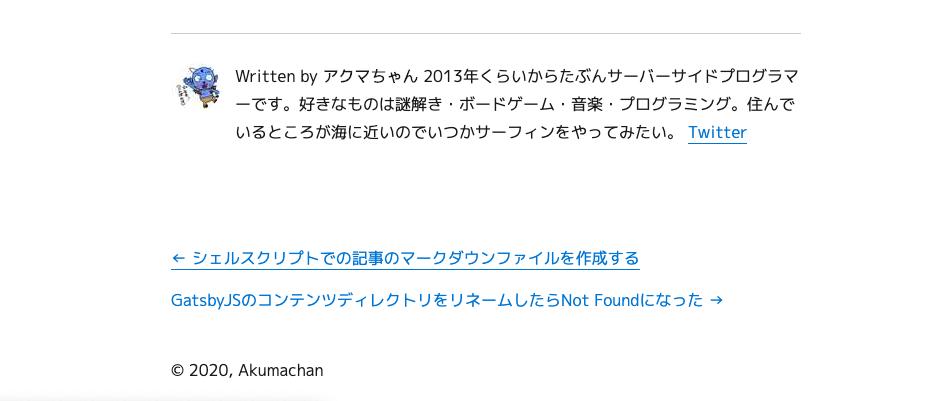

## 前後の記事へのリンク



gatsby-starter-blogにデフォルトで実装されていた記事下部の「前後の記事へのリンク」です。  
カテゴリに関係なく日付順に表示されているのですが、このブログを投稿順に読みたいというニーズは（自分を含め）皆無だと思ったので、カテゴリ内での前後の記事を表示するように修正しました。  
  
この記事を書いている時点ではどこにもカテゴリー名は表示していないのですが、そのうちカテゴリー別の目次やまとめページを作る予定なので内部的にはカテゴリー分けをしています。（参照: [シェルスクリプトで記事のマークダウンファイルを作成する](/ブログ/シェルスクリプトで記事のマークダウンファイルを作成する)）

## 現在の実装

まずは元となる現在の実装箇所を探しました。

*gatsby-node.js*

```js
posts.forEach((post, index) => {
    const previous = index === posts.length - 1 ? null : posts[index + 1].node
    const next = index === 0 ? null : posts[index - 1].node

    （...省略）
```

ここで前後のページの設定をしています。`posts`は全ポストの配列で[0]から日付の降順でポストが格納されています。  
  
`previous`では、現在のポストが最初のポストの場合はnull、それ以外のときは1つ前のポストを設定しています。  
`next`では、現在のポストが最新のポストの場合はnull、それ以外のときは1つ次のポストを設定しています。  
  
記事のページではこの`previous`、`next`を参照してリンクを表示しているようです。

## 修正

上記のコードをカテゴリ別に表示できるようにします。

#### カテゴリ情報を取得する

上記コード内の`posts`は、graphQLで取得されていますが、Front Matterの`category`が指定されていないので取得されていません（勝手につけた情報なので当たり前ですが）。  
なのでまずは`posts`の元となる`result`を取得する際に`category`を合わせて取得するように修正します。  
  
*gatsby-node.js*  
```js
const result = await graphql(
  `
    {
      allMarkdownRemark(
        sort: { fields: [frontmatter___date], order: DESC }
        limit: 1000
      ) {
        edges {
          node {
            fields {
              slug
            }
            frontmatter {
              title
              category // <---New!!
            }
          }
        }
      }
    }
  `
)
```

これで先ほどの`post`から`category`を取得できるようになりました。  
  
### ポストの設定

次は`previous`と`next`の中身をいじっていきます。
  
行う操作は  
  
`previous`の場合
- 現在のポストより過去のポストを抽出する。
- 順番に同じカテゴリのポストが見つかるまで検索する。

`next`の場合
- 現在のポストより未来のポストを抽出する。
- 順番をリバースする。（近い方から検索するため）
- 順番に同じカテゴリのポストが見つかるまで検索する。

```js
const categPrevPost = posts.slice(index + 1, posts.length).find(v =>
  v.node.frontmatter.category === post.node.frontmatter.category)
const categNextPost = posts.slice(0, index).reverse().find(v =>
  v.node.frontmatter.category === post.node.frontmatter.category)
const previous = !categPrevPost ? null : categPrevPost.node
const next = !categNextPost ? null : categNextPost.node
```

もっといい書き方があるかもしれません。あったら教えてください。  
記事が多くなってくるとどれくらい負荷がかかるかわかりませんが、まあローカルのビルドの問題なのでとりあえずこれでよしとしましょう。
  
